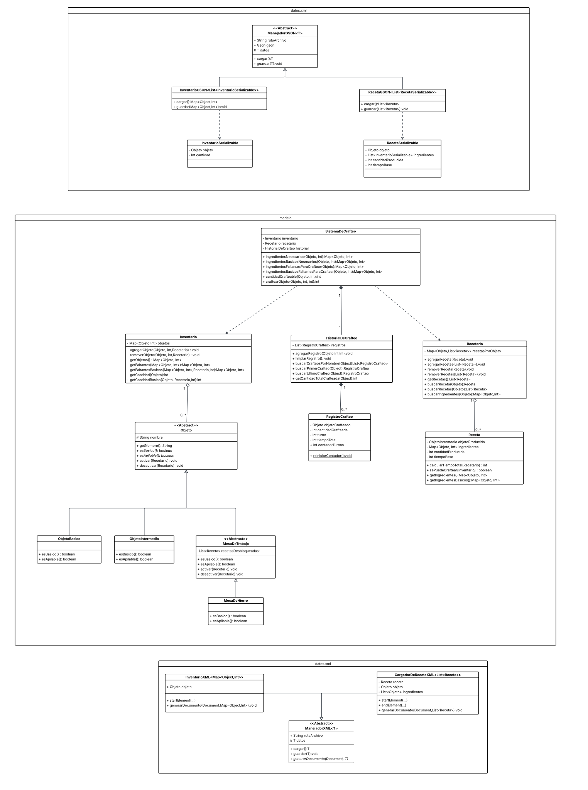

# Crafting System

## Overview
This project implements a crafting system, likely for a game or simulation. The system appears to handle inventory management, recipe handling, and crafting mechanics.

## Project Structure
- `src/main/`: Main source code
- `src/modelo/`: Model classes for the application
- `src/datos/`: Data handling classes
- `src/prolog/`: Prolog integration (possibly for rule-based logic)
- `res/`: Resource files
- `ini/`: Initial configuration files
- `test/`: Unit tests

## Configuration Files
- `ini/inventarioInicial.json`: Initial inventory configuration
- `ini/recetarioInicial.json`: Initial recipes configuration
- `ini/mesasRecetarios/`: Recipe tables configuration

## Technologies Used
- Java
- Maven (pom.xml present)
- Prolog (based on directory structure)

## Getting Started
1. Clone the repository
2. Build the project using Maven: `mvn clean install`
3. Run the application according to the specific implementation

## Features
- Inventory management
- Recipe handling
- Crafting mechanics
- Configuration via JSON files
